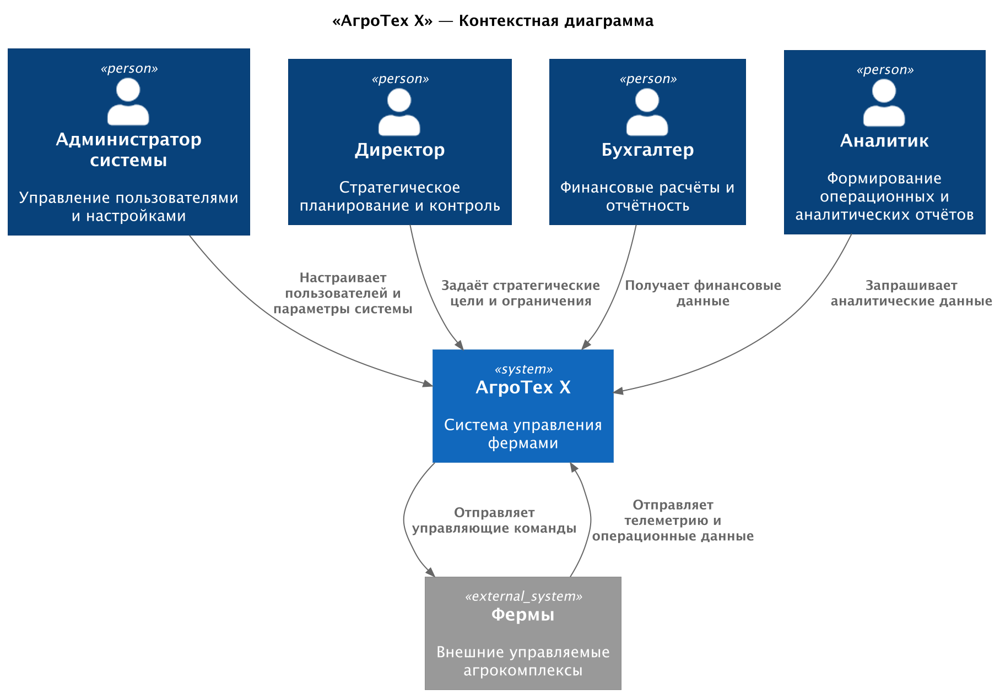
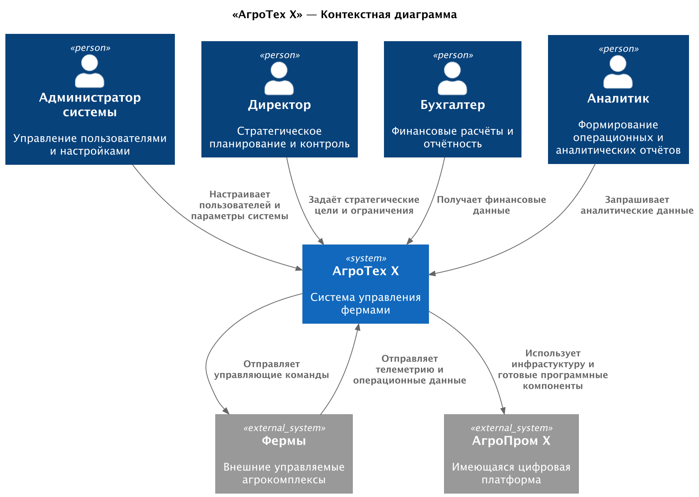

### **Название задачи:** Разработать MVP архитектуры компании «АгроТех Х»
### **Автор:** Бурганов И.И.
### **Дата:** 2025-12-26
### **Статус:** ⚠️ На рассмотрении

### **Функциональные требования**
| **№** | **Действующие лица или системы** | **Use Case**                                         | **Описание**                                                                                                  |
|:-----:|:--------------------------------:|:-----------------------------------------------------|:--------------------------------------------------------------------------------------------------------------|
|  UC1  |  Система, Администратор системы  | Заводит пользователя в системе, назначает полномочия | Администратор системы заводит нового пользователя и назначает ему роль (например, "Директор")                 |
|  UC2  |        Система, Директор         | Проводит мероприятия по управлению компанией         | Директор авторизуется в системе, просматривает отчетность, формирует производственный план, утверждает бюджет |
|  UC3  |        Система, Бухгалтер        | Проводит бухгалтерские расчеты                       | Управляет взаиморасчетами с контрагентами, фискальными органами, начисляет ЗП сотрудникам                     | 
|  UC4  |        Система, Аналитик         | Формирует отчеты                                     | Формирует отчеты                                                                                              |
|  UC5  |          Система, Фермы          | Система получает данные из фермы                     | Данные из ферм поступают в центральную систему для обработки и хранения                                       |
|  UC6  |          Система, Фермы          | Система передает команды на ферму                    | Команды поступают на ферму из центральной системы для управления фермой                                       |

### **Нефункциональные требования**
Опишите здесь нефункциональные требования и архитектурно значимые требования.

| **№** | **Требование**                                                                                                                                                                     |
|:-----:|:-----------------------------------------------------------------------------------------------------------------------------------------------------------------------------------|
|   R   | **Надежность (Reliability)**                                                                                                                                                       |
|  R1   | Обеспечить отказоустойчивость на уровне не менее 99,95%, в течение года                                                                                                            |
|       |                                                                                                                                                                                    |
|   P   | --- **Производительность (Performance)** ---                                                                                                                                       |
|  P1   | Иметь высокую производительность — от момента возникновения нештатной ситуации, зафиксированной с помощью видеоаналитики, должно проходить не более 5 секунд до момента оповещения |
|  P2   | Позволять системе видеоаналитики реагировать в реальном времени (миллисекунды).                                                                                                    |
|       |                                                                                                                                                                                    |
|   E   | **Расширяемость (Extensibility)**                                                                                                                                                  |
|  E1   | Обеспечить возможность разработать новый функционал без модификации ядра системы                                                                                                   |
|       |                                                                                                                                                                                    |
|  +R   | **Ограничения (Restrictions)**                                                                                                                                                     |
|  +R1  | Используем микросервисную архитектуру с развертыванием в Kubernetes                                                                                                                |
|  +R2  | Готовую нейросетевую модель предоставят партнёры                                                                                                                                   |
|  +R3  | Система должна корректно работать при периодической потере связи с фермой (до 24 ч).                                                                                               |

### **Решение**

Выбрана микросервисная архитектура с асинхронным обменом между системой «АгроТех Х» и фермами.
Система разрабатывается **с нуля**, без интеграции с существующими проприетарными решениями компании.

Этот подход:
- обеспечивает **лицензионную чистоту** итогового продукта,
- даёт полный контроль над архитектурой и безопасностью,
- позволяет изначально заложить поддержку **мультитенантности**, необходимую для вывода решения на SaaS-рынок.

Контекстная диаграмма основного решения:  

### **Альтернатива**
Частичное переиспользование компонентов из существующей цифровой платформы «АгроПром Х».  
Предполагалось использовать:
- существующую инфраструктуру хранения данных
- брокер сообщений
- аналитический модуль и BI-систему
- ERP-систему

Контекстная диаграмма альтернативного решения:  

### **Недостатки, ограничения, риски**

Хотя альтернатива позволяет **сократить сроки и стоимость запуска MVP**, она несёт следующие риски:
1. **Технический долг**: проприетарные компоненты «АгроПром Х» не поддерживают мультитенантность и не соответствуют требованиям SaaS.
2. **Ограниченная расширяемость**: жёсткая связь с унаследованной архитектурой затруднит добавление новых типов оборудования или интеграций.
3. **Юридические риски**: часть модулей может содержать зависимые лицензии, несовместимые с коммерческим распространением.
4. **Скрытые затраты**: миграция на мультитенантную модель в будущем потребует полной переработки ядра, что **превысит издержки greenfield-разработки**.

Таким образом, несмотря на более высокую **начальную стоимость**, **greenfield-подход выбран как стратегически предпочтительный** для достижения бизнес-цели — создания масштабируемой SaaS-платформы.

