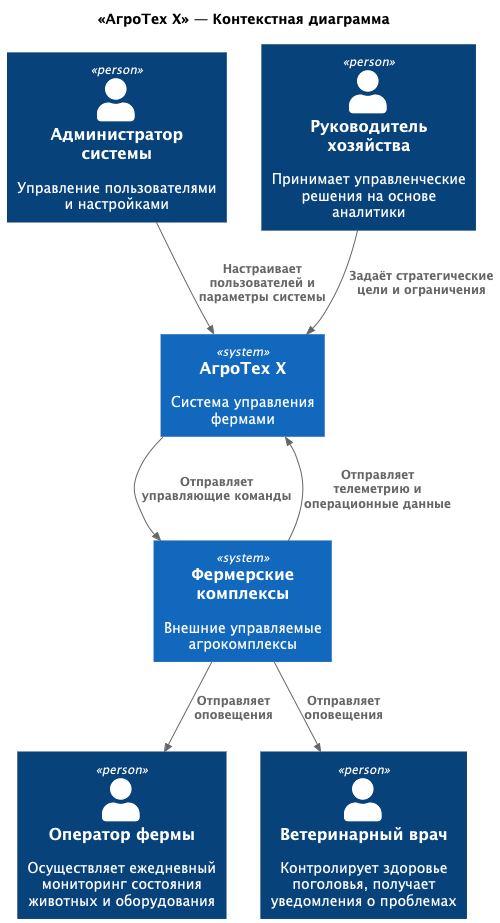
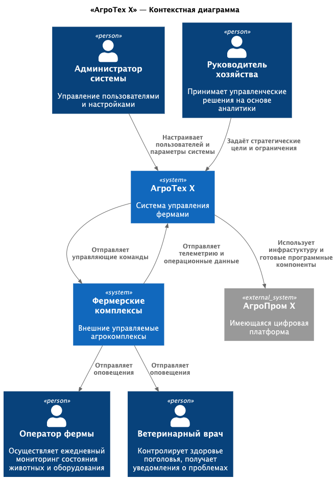

### **Название задачи:**
Проектирование MVP-системы мониторинга свиноводческих ферм: выбор архитектурного решения

### **Автор:**
Бурганов И.И.

### **Дата:**
12 января 2026 г.

---

### **Функциональные требования**

| № | Действующие лица или системы | Use Case | Описание |
| :-: | :- | :- | :- |
| 1 | Оператор фермы | Получение оповещений о нештатных ситуациях | Система должна уведомлять оператора при признаках драк, задавливания поросят, гибели животных и т.п. |
| 2 | Ветеринарный врач | Мониторинг состояния поголовья | Получение уведомлений о болезнях, аномальном поведении, смертности |
| 3 | Администратор системы | Управление пользователями и ролями | Настройка доступа, ролей, интеграция с IAM |
| 4 | Руководитель хозяйства | Просмотр аналитики и KPI | Получение отчётов по эффективности кормления, поголовью, расходу ресурсов |
| 5 | Фермерские комплексы (агенты) | Отправка телеметрии | Передача видео, данных с датчиков, статусов оборудования |
| 6 | Фермерские комплексы (агенты) | Приём управляющих команд | Выполнение команд на включение/отключение кормушек, поилок и т.д. |
| 7 | Система | Автономная работа на ферме | Обеспечение работы при отсутствии интернета и последующая синхронизация |
| 8 | Система | Интеграция с внешними сервисами | Предоставление API для мобильных и веб-приложений |

---

### **Нефункциональные требования**

| № | Требование |
| :-: | :- |
| 1 | Отказоустойчивость 99,95% |
| 2 | Время реакции на нештатную ситуацию ≤ 5 секунд |
| 3 | Видеоаналитика — реагирование в реальном времени (мс) |
| 4 | Поддержка offline-режима на ферме до 10 минут без потери данных |
| 5 | Расширяемость — возможность добавления новых метрик и модулей без переработки ядра |
| 6 | Совместимость с камерами разных производителей |
| 7 | Безопасность — поддержка современных методов аутентификации и авторизации (OAuth2 / OpenID Connect) |
| 8 | Горизонтальная масштабируемость для будущего SaaS-развёртывания |

---

### **Решение**

Для MVP предложено **основное решение**, в котором новая система мониторинга свиноводческих ферм (`АгроТех Х`) разрабатывается как **независимая платформа**, полностью автономная на этапе запуска. Она взаимодействует только с фермами (агентами) и пользователями, но **не интегрируется** с существующей цифровой платформой `АгроПром X`.

**Преимущества основного решения:**
- Минимальная зависимость от устаревших компонентов `АгроПром X`.
- Быстрый запуск MVP (6–8 недель).
- Чёткая граница ответственности: новая система — только для животноводства.
- Возможность полной контроля над стеком технологий (Kafka, Spring Boot, ClickHouse, MinIO, edge-обработка видео).
- Легко адаптируется под будущее SaaS-развёртывание.

**Ключевые элементы:**
- **Edge-агенты** на фермах: обрабатывают видео в реальном времени, управляют оборудованием, работают offline.
- **Центральный сервер**: агрегирует данные, хранит метрики, управляет пользователями, отправляет уведомления.
- **API-шлюз**: для мобильных и веб-приложений.
- **Видеоаналитика**: запускается локально на GPU-устройствах на ферме, использует предоставленную партнёрами модель ИИ.

---

### **Альтернативы**

**Альтернативное решение** предполагает **интеграцию с существующей платформой `АгроПром X`**:
- Использование Kafka, Data Lake (MinIO), DWH (ClickHouse) из текущей архитектуры.
- Авторизация через существующий IAM.
- Отправка аналитики в BI-систему Power BI.

**Преимущества альтернативы:**
- Повторное использование готовой инфраструктуры.
- Единая точка входа для всех пользователей.
- Централизованное хранение данных.

**Недостатки, ограничения, риски**

| Категория | Описание |
| :- | :- |
| **Технические риски** | - Нестабильность WiFi на фермах может нарушить синхронизацию с центральной Kafka. - Текущая Kafka не оптимизирована под high-throughput видео-метаданных (тысячи событий/сек). - Отсутствие поддержки offline-очередей в текущей инфраструктуре. |
| **Организационные риски** | - Зависимость от команды, поддерживающей `АгроПром X`, которая занята другими задачами. - Необходимость согласования изменений в общей шине данных. |
| **Временные затраты** | - Интеграция с ERP, Kafka, IAM потребует минимум +3–4 недели. - Тестирование отказоустойчивости в гибридном режиме (online/offline) усложнится. |
| **Масштабируемость** | - Архитектура `АгроПром X` не рассчитана на мультитенантность — это помешает будущему SaaS. |
| **Безопасность** | - Текущая IAM не поддерживает fine-grained RBAC для операторов на уровне ферм. |

**Вывод:**  
Альтернативное решение экономит ресурсы инфраструктуры, но **замедляет MVP и создаёт технический долг**. Для целей MVP (быстро, автономно, масштабируемо) **предпочтительно основное решение**.

---

### Приложения

#### Диаграмма C1 — Основное решение

#### Диаграмма C1 — Альтернативное решение
