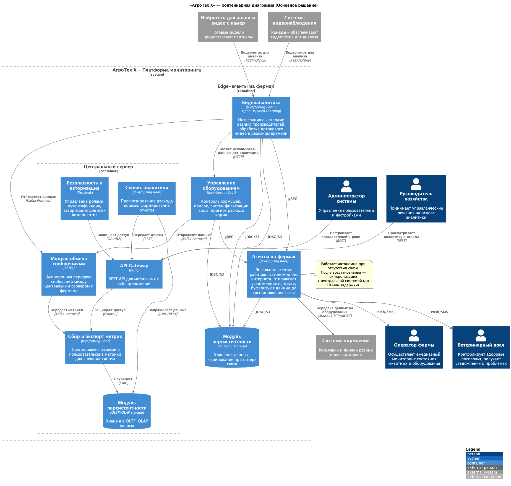
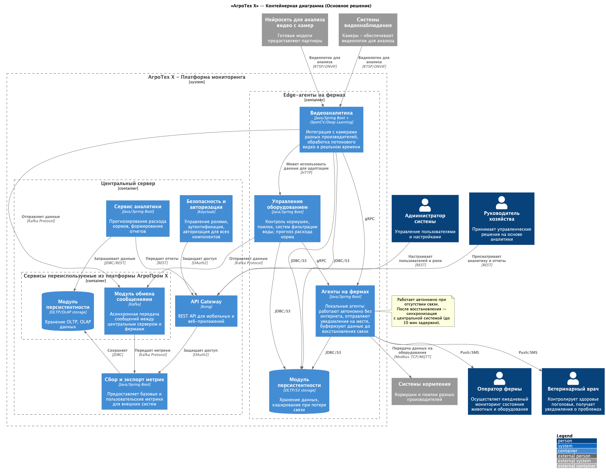

### **Название задачи:**
Проектирование MVP-системы мониторинга свиноводческих ферм: выбор архитектурного решения (расширенный ADR с контейнерным уровнем)

### **Автор:**
Бурганов И.И.

### **Дата:**
12 января 2026 г.

---

### **Функциональные требования**

| № | Действующие лица или системы | Use Case | Описание |
| :-: | :- | :- | :- |
| 1 | Оператор фермы | Получение оповещений о нештатных ситуациях | Система должна уведомлять оператора при признаках драк, задавливания поросят, гибели животных и т.п. |
| 2 | Ветеринарный врач | Мониторинг состояния поголовья | Получение уведомлений о болезнях, аномальном поведении, смертности |
| 3 | Администратор системы | Управление пользователями и ролями | Настройка доступа, ролей, интеграция с IAM |
| 4 | Руководитель хозяйства | Просмотр аналитики и KPI | Получение отчётов по эффективности кормления, поголовью, расходу ресурсов |
| 5 | Фермерские комплексы (агенты) | Отправка телеметрии | Передача видео, данных с датчиков, статусов оборудования |
| 6 | Фермерские комплексы (агенты) | Приём управляющих команд | Выполнение команд на включение/отключение кормушек, поилок и т.д. |
| 7 | Система | Автономная работа на ферме | Обеспечение работы при отсутствии интернета и последующая синхронизация |
| 8 | Система | Интеграция с внешними сервисами | Предоставление API для мобильных и веб-приложений |

---

### **Нефункциональные требования**

| № | Требование |
| :-: | :- |
| 1 | Отказоустойчивость 99,95% |
| 2 | Время реакции на нештатную ситуацию ≤ 5 секунд |
| 3 | Видеоаналитика — реагирование в реальном времени (мс) |
| 4 | Поддержка offline-режима на ферме до 10 минут без потери данных |
| 5 | Расширяемость — возможность добавления новых метрик и модулей без переработки ядра |
| 6 | Совместимость с камерами разных производителей |
| 7 | Безопасность — поддержка современных методов аутентификации и авторизации (OAuth2 / OpenID Connect) |
| 8 | Горизонтальная масштабируемость для будущего SaaS-развёртывания |

---

### **Решение**

**Основное решение** — полностью автономная платформа `АгроТех Х`, не зависящая от существующей `АгроПром X`.

#### Архитектурные границы

Система разделена на два ключевых ограниченных контекста:

1. **Центральный сервер** — cloud-часть, отвечающая за:
    - Авторизацию (Keycloak),
    - API-доступ (Kong),
    - Аналитику и прогнозирование,
    - Хранение OLTP/OLAP-данных,
    - Обмен сообщениями через Kafka.

2. **Edge-агенты на фермах** — on-prem часть, отвечающая за:
    - Реальную обработку видеопотока (Java + OpenCV + DL),
    - Управление оборудованием (Modbus TCP, MQTT),
    - Локальное хранение данных (PostgreSQL + MinIO),
    - Offline-режим с буферизацией событий.

#### Ключевые технологии и обоснование

| Компонент | Технология | Обоснование |
| :- | :- | :- |
| **API Gateway** | Kong | Поддержка OAuth2, rate limiting, легко масштабируется, Kubernetes-native |
| **IAM** | Keycloak | Open-source, поддержка fine-grained RBAC, совместимость с Spring Security |
| **Message Broker** | Apache Kafka | Высокая пропускная способность, надёжная доставка, поддержка offline-буферизации через Kafka Connect + local storage |
| **Видеоаналитика** | Java/Spring Boot + OpenCV + TensorRT | Возможность запуска модели на GPU edge-устройств, low-latency inference |
| **Хранилище (центр)** | PostgreSQL + ClickHouse | OLTP (PostgreSQL) + OLAP (ClickHouse) — раздельное хранение для производительности |
| **Хранилище (edge)** | Embedded PostgreSQL + MinIO | Минимальный footprint, поддержка локального кэширования видеофрагментов и метаданных |
| **Протоколы связи** | RTSP/ONVIF, Modbus TCP, MQTT, gRPC | Поддержка legacy оборудования и современных IoT-протоколов |

#### Offline-режим
Edge-агенты работают автономно:
- Все события (видеоаномалии, показания датчиков, команды) сохраняются локально.
- При восстановлении связи данные отправляются в Kafka с временной меткой.
- Задержка синхронизации до 10 минут допустима согласно требованиям.

#### Производительность
- Видеоаналитика выполняется **локально** на ферме, что удовлетворяет требованию ≤5 сек на реакцию.
- Центральный сервер не участвует в обработке видео и масштабируется независимо.

---

### **Альтернативы**

**Альтернативное решение** предполагает **повторное использование компонентов из `АгроПром X`**:
- Kafka и хранилища (MinIO, ClickHouse) используются как общие.

#### Преимущества
- Экономия на инфраструктуре.

#### Недостатки, ограничения, риски

| Категория | Описание |
| :- | :- |
| **Технические риски** | - Текущая Kafka не имеет механизма offline-буферизации на edge. - ClickHouse не подходит для OLTP-операций (например, управление состоянием оборудования). - Нет гарантии SLA для нового трафика от ферм. |
| **Организационные риски** | - Любые изменения в `АгроПром X` требуют согласования и могут блокировать MVP. - Отсутствие выделенной команды поддержки для интеграции. |
| **Производительность** | - Видеоаналитика генерирует тысячи событий/сек — текущая Kafka может стать узким местом. - Централизованное хранилище не оптимизировано под edge-to-cloud sync. |
| **Масштабируемость** | - Архитектура `АгроПром X` не предусматривает изоляцию клиентов → проблема при переходе к SaaS. |

---

### **Компромиссы**

| Компромисс | Обоснование |
| :- | :- |
| **Локальная база данных на edge** вместо полной синхронизации с центром | Необходимо для offline-режима и снижения latency. Данные синхронизируются только при наличии связи. |
| **Дублирование Kafka** (отдельный кластер для `АгроТех Х`) | Позволяет изолировать нагрузку и гарантировать SLA. Увеличивает TCO, но критично для MVP. |
| **Использование gRPC между edge-компонентами** | Высокая производительность и типобезопасность, но требует codegen. Оправдано для внутреннего взаимодействия. |

---

### Приложения

#### Диаграмма C2 — Основное решение

#### Диаграмма C2 — Альтернативное решение

