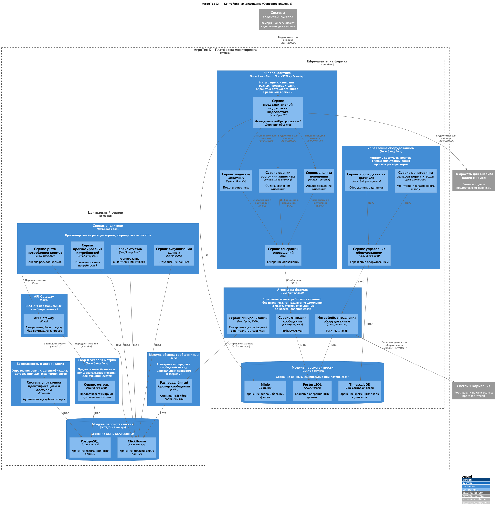
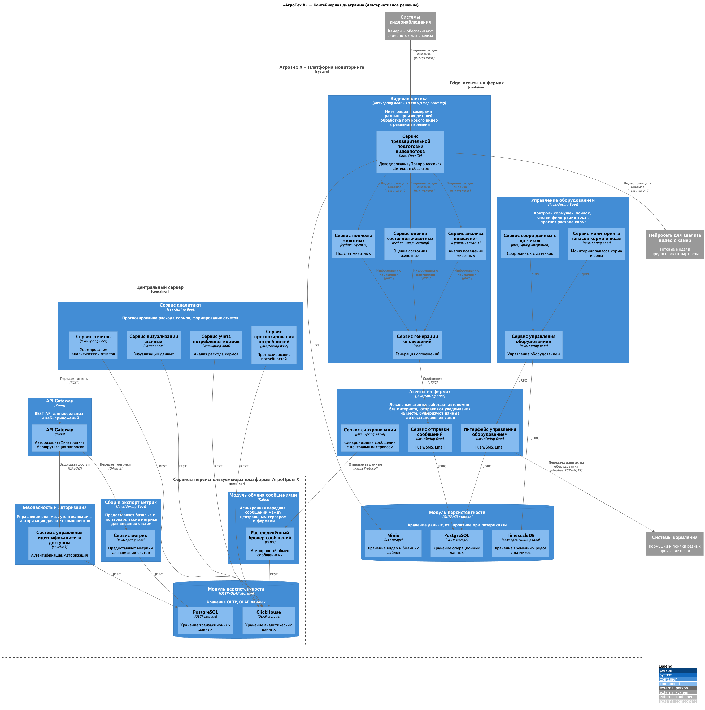

### **Название задачи:**
Проектирование MVP-системы мониторинга свиноводческих ферм: детализация архитектуры на уровне компонентов (C3) и кода (C4)

### **Автор:**
Бурганов И.И.

### **Дата:**
12 января 2026 г.

---

### **Функциональные требования**

| № | Действующие лица или системы | Use Case | Описание |
| :-: | :- | :- | :- |
| 1 | Оператор фермы | Получение оповещений о нештатных ситуациях | Система должна уведомлять оператора при признаках драк, задавливания поросят, гибели животных и т.п. |
| 2 | Ветеринарный врач | Мониторинг состояния поголовья | Получение уведомлений о болезнях, аномальном поведении, смертности |
| 3 | Администратор системы | Управление пользователями и ролями | Настройка доступа, ролей, интеграция с IAM |
| 4 | Руководитель хозяйства | Просмотр аналитики и KPI | Получение отчётов по эффективности кормления, поголовью, расходу ресурсов |
| 5 | Фермерские комплексы (агенты) | Отправка телеметрии | Передача видео, данных с датчиков, статусов оборудования |
| 6 | Фермерские комплексы (агенты) | Приём управляющих команд | Выполнение команд на включение/отключение кормушек, поилок и т.д. |
| 7 | Система | Автономная работа на ферме | Обеспечение работы при отсутствии интернета и последующая синхронизация |
| 8 | Система | Интеграция с внешними сервисами | Предоставление API для мобильных и веб-приложений |

---

### **Нефункциональные требования**

| № | Требование |
| :-: | :- |
| 1 | Отказоустойчивость 99,95% |
| 2 | Время реакции на нештатную ситуацию ≤ 5 секунд |
| 3 | Видеоаналитика — реагирование в реальном времени (мс) |
| 4 | Поддержка offline-режима на ферме до 10 минут без потери данных |
| 5 | Расширяемость — возможность добавления новых метрик и модулей без переработки ядра |
| 6 | Совместимость с камерами разных производителей |
| 7 | Безопасность — поддержка современных методов аутентификации и авторизации (OAuth2 / OpenID Connect) |
| 8 | Горизонтальная масштабируемость для будущего SaaS-развёртывания |

---

### **Решение**

**Основное решение** — полностью автономная платформа `АгроТех Х`, не зависящая от `АгроПром X`.

#### Ограниченные контексты

Система разделена на два ключевых ограниченных контекста:

1. **Центральный сервер:**
    - **Security Gateway**: Keycloak для RBAC.
    - **API Gateway**: Kong + Spring Security OAuth2.
    - **Analytics Service**: прогнозирование, отчётность, визуализация.
    - **Metrics Engine**: экспорт метрик во внешние системы.
    - **Хранилище**: PostgreSQL (OLTP) + ClickHouse (OLAP).

2. **Edge-агенты (On-Prem):**
    - **Видеоаналитика**: предобработка, анализ поведения, оценка здоровья, генерация оповещений.
    - **Управление оборудованием**: сбор данных с датчиков, контроль кормушек/поилок, мониторинг запасов.
    - **Локальные агенты**: синхронизация, отправка оповещений, интерфейс оборудования.
    - **Хранилище**: PostgreSQL (операционные данные), MinIO (видеофрагменты), TimescaleDB (временные ряды).

#### Ключевые компоненты и их взаимодействие

| Компонент | Технология | Ответственность | Интерфейсы |
| :- | :- | :- | :- |
| **video_pre_processor** | Java + OpenCV | Декодирование RTSP, препроцессинг, детекция объектов | RTSP/ONVIF → gRPC |
| **behavior_analysis** | Python + TensorRT | Анализ поведения (драки, беспокойство) | gRPC → alert_generation_service |
| **health_assessment** | Python + Deep Learning | Оценка состояния (болезнь, гибель) | gRPC → alert_generation_service |
| **alert_generation_service** | Java/Spring Boot | Генерация событий тревоги | gRPC → alert_service |
| **equipment_control_service** | Java/Spring Boot | Управление оборудованием через Modbus/MQTT | gRPC ↔ equipment_interface |
| **message_sync** | Java/Spring Kafka | Буферизация и синхронизация с центром | Kafka Protocol |
| **forecasting** | Java/Spring Boot | Прогноз потребностей в корме/воде | REST → ClickHouse |
| **gateway_service** | Kong | Авторизация, маршрутизация, rate limiting | OAuth2, REST |

---

### **Альтернативы**

**Альтернативное решение** предполагает:
- Использование существующих Kafka и хранилищ из `АгроПром X`.
- Упрощённую модель компонентов без явного разделения аналитики и управления.

#### Недостатки, ограничения, риски

| Категория | Описание                                                                                                                                                               |
| :- |:-----------------------------------------------------------------------------------------------------------------------------------------------------------------------|
| **Технические риски** | - Отсутствие гарантий SLA для Kafka. - Невозможность контролировать версионирование ClickHouse/PostgreSQL. - Нет поддержки TimescaleDB в текущей инфраструктуре. |
| **Производительность** | - Централизованная Kafka не масштабируется под нагрузку тысяч видеособытий/сек. - Задержки при записи в ClickHouse из-за смешанной нагрузки.                        |
| **Поддержка** | - Любые изменения в `АгроПром X` требуют согласования, что приведет к замедлению в готовности MVP.                                                                     |
| **SaaS-перспектива** | - Архитектура не поддерживает multi-tenancy, потребуется полная переработка.                                                                                           |

---

### **Компромиссы**

| Компромисс | Обоснование |
| :- | :- |
| **Python для видеоаналитики, Java для остального** | Python — стандарт в CV/DL; Java — надёжность, типобезопасность, Spring ecosystem. |
| **Локальное TimescaleDB на edge** | Необходимо для временных рядов с датчиков; PostgreSQL не оптимален для этого. |
| **MinIO вместо облака** | Обеспечивает S3-совместимость и работает offline. |
| **Отдельный Kafka-кластер** | Изоляция нагрузки, гарантия SLA, но увеличение TCO. |
| **gRPC между компонентами edge** | Низкая latency, строгая контрактность, но требует codegen. |

---

### Приложения

#### Диаграмма C3 — Основное решение

#### Диаграмма C3 — Альтернативное решение
